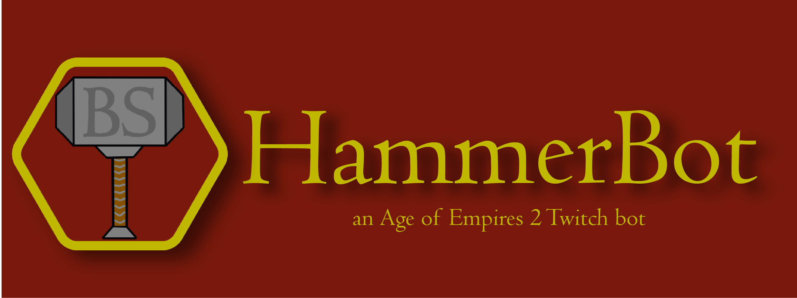
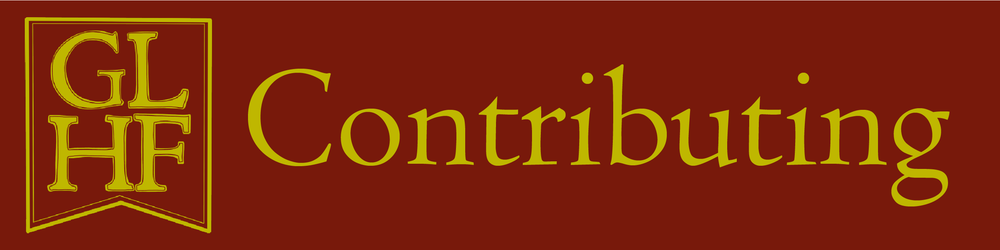

    

HammerBot is a Twitch bot built for an Age of Empire II streamer's Twitch stream. HammerBot features Age of Empires II specific commands, such as `!whichciv <techName>` which returns a list of civs that get that specific technology in-game.  

This HammerBot is a duplicate of the [Discord HammerBot](https://github.com/makayla-moster/HammerBot) but for Twitch Age of Empires 2 streamers!
  
Specific features include:
- Team civilization randomizer for 2v2s, 3v3s, and 4v4s that takes into account pocket or flank positions
- Finding out if a civilization has a specific technology or unit
- Returning in-game [taunts](https://ageofempires.fandom.com/wiki/Taunts)
- Player rank and match commands with info pulled from the [aoe2.net](https://aoe2.net/#api) API
- And more!

<!-- ## Python Packages & Software -->

HammerBot is built with [PythonTwitchBotFramework](https://github.com/sharkbound/PythonTwitchBotFramework), an asynchronous Twitchbot framework.

Other packages/libraries used inclue:
- asyncio
- aiohttp

HammerBot currently has a very simple setup, where all commands are split into their own libraries. Additionally, HammerBot also has an SQLite database.

We currently have commands for:  
- Age of Empires 2 player info
- Age of Empires 2 taunts
- Error handling
- Bot services (help and info commands)
- PythonTwitchBotFramework built-in commands

<!-- ## Contributing to HammerBot -->

### Issues & Bugs
If a bug or any unintended behavior is discovered, please report it by creating an issue [here](https://github.com/makayla-moster/HammerBot_Twitch/issues).

### HammerBot Development
If you'd like to contribute code to HammerBot, please:
1. Fork the repository 
2. Make any contributions in your fork       
3. Create a [pull request](https://github.com/makayla-moster/HammerBot_Twitch/pulls)

<!-- Your pull request will then be reviewed. Please read the [Contributing Guidelines](https://github.com/makayla-moster/HammerBot/blob/main/CONTRIBUTING.md) before creating your first pull request.

### Setting Up HammerBot
After forking the repository:
1. `git clone` HammerBot, and `cd` into the `HammerBot` directory
2. Make a new file called `.env` and fill in the fields based off the `.env.example` file
3. Use [poetry](https://python-poetry.org) to install the necessary dependencies with `poetry install`
4. Run HammerBot with either `poetry run python3 hammerbot.py` (mac/linux) or `poetry run py hammerbot.py` (windows) -->
